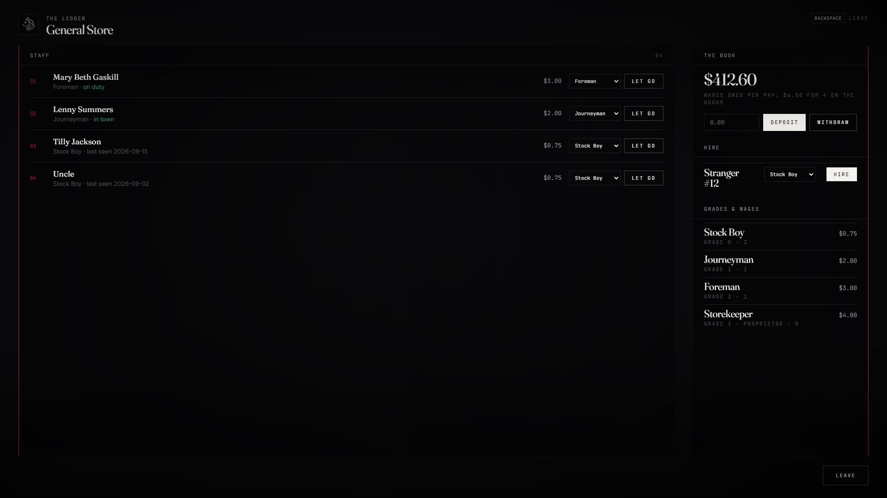

# lxr-business — The proprietor's ledger, for LXRCore

Every job in the core registry with grades is a business here. The
proprietor, or any grade with hire / fire / promote / society permissions,
opens the ledger at the desk: the staff, on and off line; hiring whoever
stands at the desk; promotions and demotions below one's own grade; letting
people go; the society book and the wages it owes per pay; money between
the book and the till. The grade ladder and the wages come from the
registry, the book from lxr-bank, the staff changes from the core.



## What it does

* **Staff** — online staff first (duty shown), then everyone on the books
  from the database with the day they were last seen.
* **Hire** — a person standing at the desk, into any grade below yours
  (the proprietor may use any grade); trades marked `hireable = false` in
  the registry are not hired at a desk.
* **Grades** — promote and demote below your own grade (`promote`
  permission); let go (`fire`); never yourself, never above yourself.
* **The book** — balance from lxr-bank's `society_<job>`, the wage bill
  from the grade wages × headcount, deposit and withdraw with the `society`
  permission (`Config.Ledger.maxMove`).
* **Desks** — `Config.Desks[job]` positions as lxr-interact points; or
  `/ledger` anywhere when `Config.Ledger.anywhere` is on.
* **Events** — `lxr:business:hired / graded / fired (job, citizenid, level, by)`.

## Install

```cfg
ensure lxr-core
ensure lxr-nui
ensure lxr-interact
ensure lxr-bank
ensure lxr-business
```

No SQL: staff live in the core's `players` table, books in lxr-bank.

## Configuration

`config.lua` — `Config.Lang`, `Config.Desks`, `Config.Ledger`,
`Config.Security`.

## API

| Name | Side | Purpose |
|---|---|---|
| `Staff(job)` · `Hire(citizenid, job, level)` | server | other resources' hooks |
| `Open()` | client | open the ledger (the caller must manage their job) |

## Licence

© 2026 iBoss21 / LXRCore — All Rights Reserved. See `LICENSE`.
